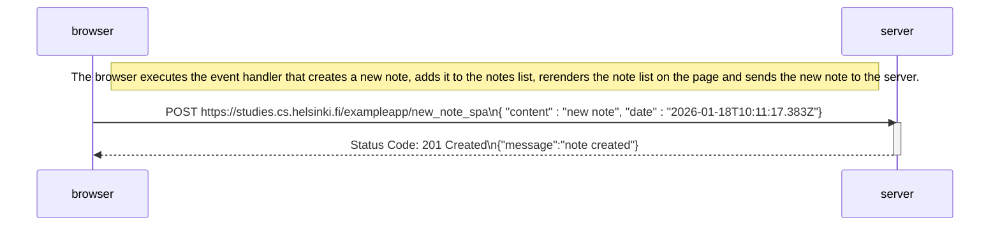

```mermaid
sequenceDiagram
    participant browser
    participant server

    Note right of browser: The browser executes the event handler that creates a new note, adds it to the notes list, rerenders the note list on the page and sends the new note to the server.

    browser->>server: POST https://studies.cs.helsinki.fi/exampleapp/new_note_spa\n{ "content" : "new note", "date" : "2026-01-18T10:11:17.383Z"}
 
    activate server
    server-->>browser: Status Code: 201 Created\n{"message":"note created"}
    deactivate server
    
```